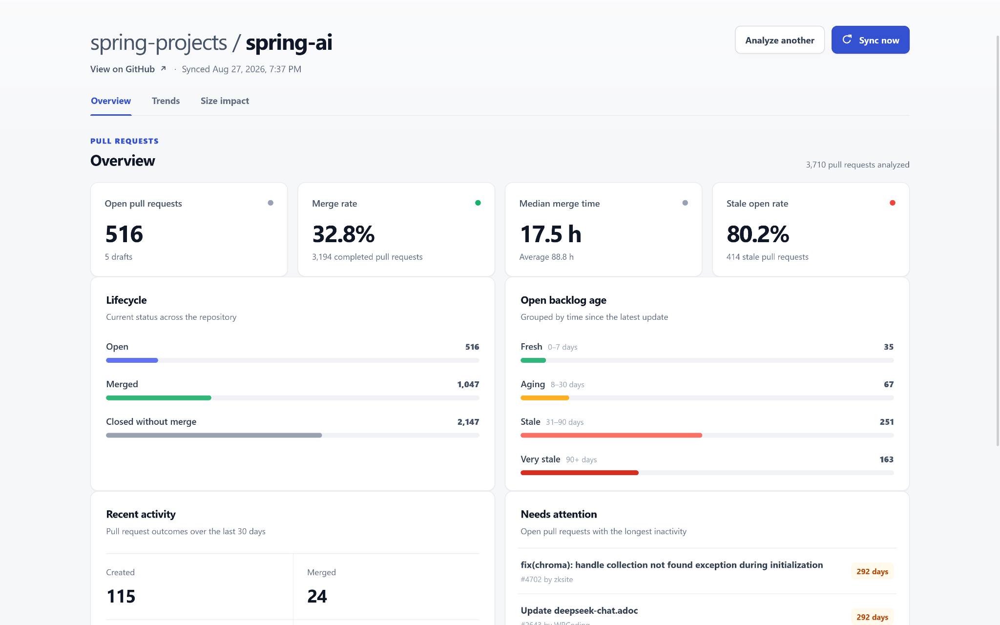
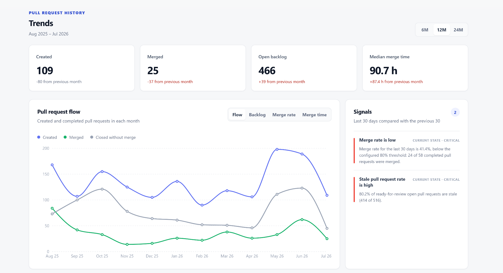
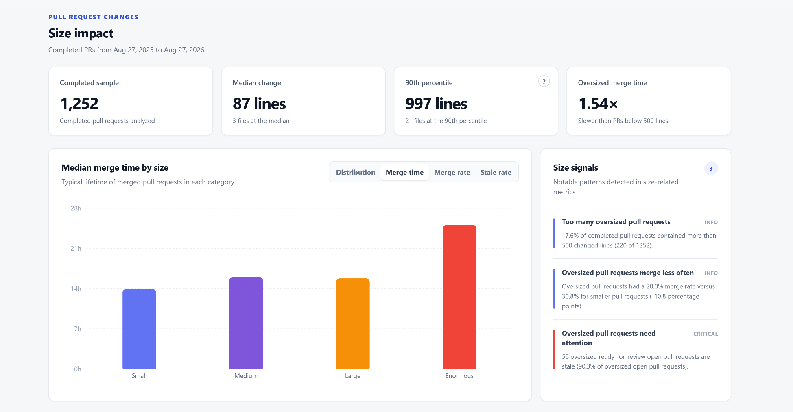
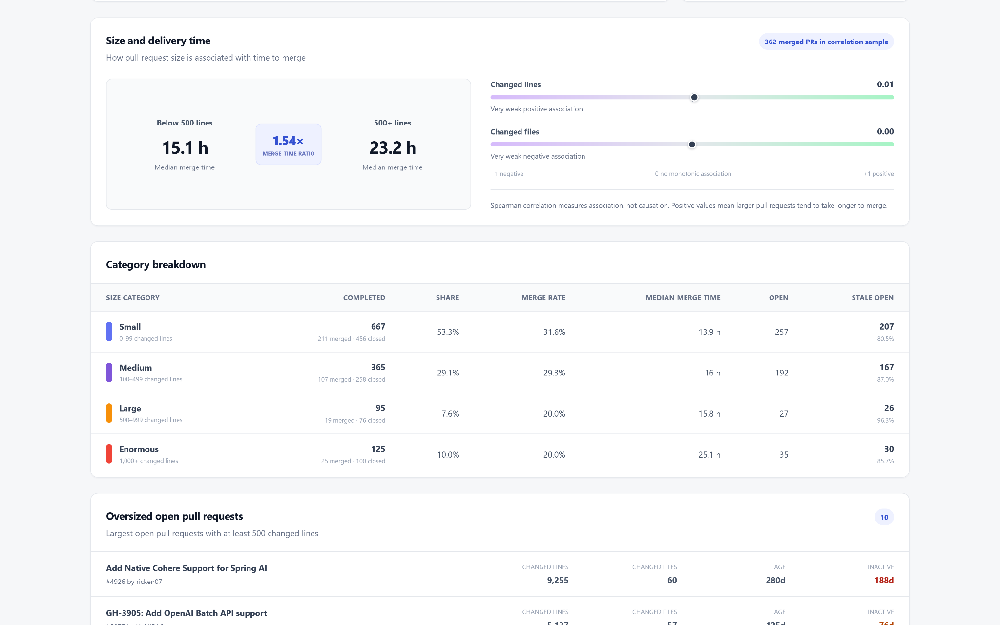

# RepoPulse

**Turn GitHub pull request history into actionable delivery insights.**

RepoPulse is a full-stack analytics dashboard for public GitHub repositories. Paste a repository
URL to explore delivery speed, backlog health, historical trends, and the relationship between
pull request size and delivery outcomes.

_Repository health overview._

## What RepoPulse shows

| Area | Included analytics |
| --- | --- |
| **Overview** | Open, draft, merged, and closed pull requests; merge rate; average and median merge time |
| **Backlog health** | Fresh, aging, stale, and very stale groups; stale-open rate; pull requests needing attention |
| **Recent activity** | Pull requests created, merged, and closed during the last 30 days; unique authors |
| **Trends** | 6, 12, or 24 completed months of throughput, backlog, merge rate, and median merge time |
| **Size impact** | Size distribution, p90, category-level delivery metrics, oversized pull requests, and Spearman correlations |
| **Signals** | Rule-based insights for growing backlog, slower delivery, lower merge rate, stale work, and size-related friction |

_Twelve months of pull request flow with automatically generated repository signals._

## Highlights

- Accepts standard `https://github.com/{owner}/{repository}` URLs, including an optional `.git`
  suffix.
- Uses both the GitHub REST API and GraphQL API: REST for repository metadata and GraphQL for
  paginated pull request history and size data.
- Stores synchronized data in PostgreSQL through Spring Data JPA and manages the schema with
  Flyway migrations.
- Performs transactional page-level upserts, allowing existing pull requests to be refreshed
  without duplicating records.
- Avoids unnecessary GitHub requests with a 15-minute freshness window, while the **Sync now**
  action can force an immediate refresh.
- Calculates analytics on the backend and renders responsive, lazy-loaded dashboard sections with
  React, TypeScript, and Recharts.
- Handles loading, empty, and failure states independently for overview, trends, insights, and size
  analytics.

## How it works

1. The backend validates the repository URL and retrieves repository metadata from GitHub.
2. Pull request summaries are fetched through cursor-based GraphQL pagination in pages of 100.
3. Additions, deletions, and changed files are fetched separately in pages of 75.
4. Each page is transactionally inserted or updated in PostgreSQL.
5. Server-side calculators derive overview, trend, size, and insight responses from the stored data.
6. The React dashboard requests each analytics view only when it is needed.

Subsequent synchronization is incremental: RepoPulse requests the most recently updated pull
requests first and stops once it reaches data older than the previous synchronization boundary.

## Analytics model

Pull requests are classified by changed lines:

| Category | Changed lines |
| --- | ---: |
| Small | `< 100` |
| Medium | `100–499` |
| Large | `500–999` |
| Enormous | `>= 1,000` |

Large and enormous pull requests are treated as **oversized**. Size analytics cover the most recent
year and include:

- median and 90th-percentile changed lines and files;
- distribution, merge rate, median merge time, and stale rate for each size category;
- median merge-time comparison between oversized and non-oversized pull requests;
- Spearman rank correlation between merge time and both changed lines and changed files;
- the largest currently open pull requests that may need attention.

_Category-level merge time, sample statistics, and size-related signals._

RepoPulse deliberately hides statistics that would be misleading for a small sample. A percentile
requires at least 20 completed pull requests, a correlation requires at least 30 merged pull
requests, and the oversized merge-time comparison requires at least 10 merged pull requests both
in oversized and non-oversized groups.

_Merge-time comparison, Spearman correlations, category breakdown, and oversized open pull requests._

## Tech stack

### Backend

- Java 21
- Spring Boot 4.1
- Spring Web MVC and `RestClient`
- Spring Data JPA / Hibernate
- REST API / GraphQL
- PostgreSQL
- Flyway
- Maven Wrapper

### Frontend

- React 19
- TypeScript 6
- Vite 8
- Recharts
- Prettier

